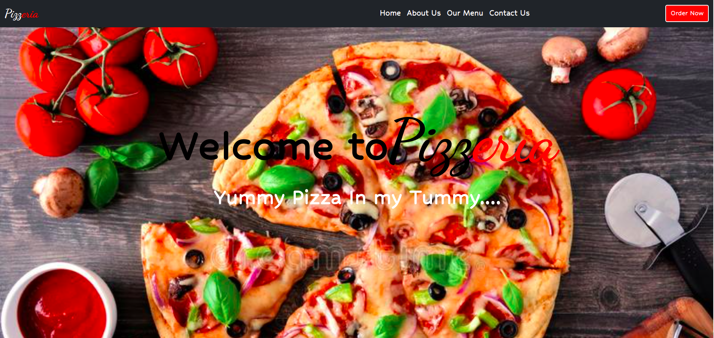
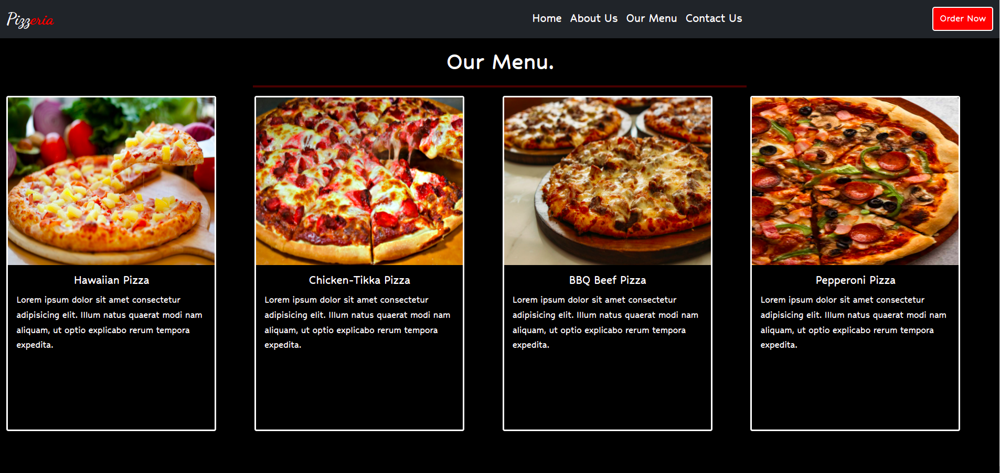

# Pizzeria

##### By Florence Wambui.

## Table of Content

- [Description](#description)
- [Technology Used](#technology-used)
- [Reference](#reference)
- [Authors Info](#author-Info)

## Description

This is  a website of a pizza restaurant. It showcases the rich heritage of the pizza offering and gives a brief history of the establishment. A user is able to navigate through the rich menu section and gather data on the available menu options then proceed to place an order depending on the wide selection. A user is charged depending on the size of pizza, type of crust and additional toppings. Further, a user has an option to have the pizza delivered at an extra charge else otherwise the user enjoys the pizza in-store location.

### Apperance.

**Landing page**

**Discover Name Page**

**Live Page**

- This is the link to the live page: 

### Requirements

- Access to a desktop or laptop.
- An access to the Internet.

## Technology Used

- HTML - which is used to build the structure of the pages.

- CSS - which is used to style the web pages.

- Bootstrap - which is used in styling.

- Javascript, JQuery.

## Reference

- MDN Documents.
- W3 Schools.
- Bootstrap Documentation
- You-Tube Tutorials.

## Authors Info

Email Address- [Florence Wambui.](mailto:gflorencewambui@gmail.com?subject=[GitHub]%20Source%20Florence)

Copyright (c) [2022] Florence Wambui.

